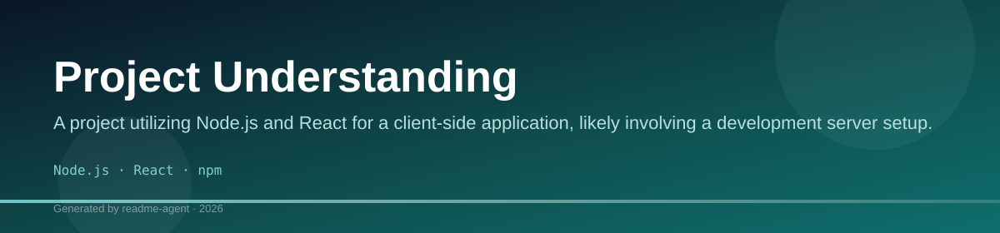
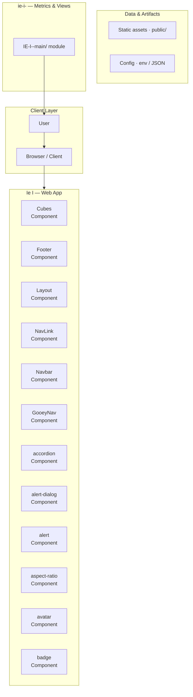
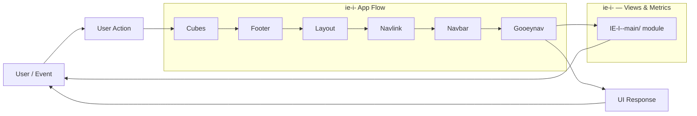
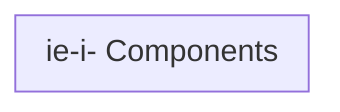
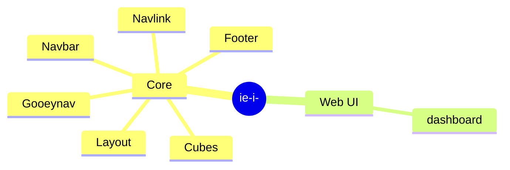

# Project Understanding

A project utilizing Node.js and React for a client-side application, likely involving a development server setup.

## Overview

The project is a client-side application managed by npm, suggesting a modern web development stack. The primary entry point for development is defined in the `package.json` file, which specifies scripts for starting the development server and running tests. The project structure suggests a standard Node/React setup.

## Key Features

- Development server setup via `npm run dev`
- Testing capability via `npm test`

## Technology Stack

- Node.js
- React
- npm

## Project Overview

The project is a client-side application built using a modern web development stack, managed via npm. It utilizes Node.js and React, providing a standard setup for client-side development.

## Technologies

This project is built with:

*   Node.js
*   React
*   npm

## Getting Started

### Prerequisites

Ensure you have Node.js and npm installed.

### Installation

To install the necessary dependencies, run the following command in the project root:

```bash
npm i
```

## Usage

### Running the Development Server

To start the local development server, use the following script:

```bash
npm run dev
```

This command will run the application in development mode.

## Testing

Testing can be initiated using the dedicated test script:

```bash
npm test
```

## Limitations

*   No specific details regarding the application's core functionality or API endpoints are available beyond the package scripts.

## Setup Guide

### Frontend Setup

```bash

npm install
npm run dev     # development
npm run build && npm start   # production
```

Open `http://127.0.0.1:5173` (or the port shown in the terminal).

### Configuration

Copy environment templates before running:

- `.env.example` → copy to `.env` in the same directory

### Running the Application

1. **Start web app** — `npm run dev` in `./`

```bash
cd .
npm install
npm run dev
```

## System Architecture

High-level system design, data flows, API map, and workflow pipelines derived from the repository structure.

### System Architecture



### Data Flow & Charts Pipeline



### Component & API Map



### Application Page Map



## Screenshots & Assets


## Application Pages

Screenshots captured from the running application. Each page is listed with its function.

### Application

#### About

About — application page at `/about`


